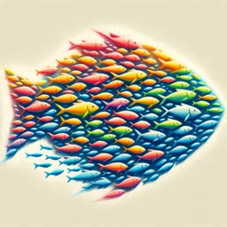

A [**resonator**](https://colab.research.google.com/github/0xmaddie/0xmaddie/blob/main/resonators.ipynb)
is like a neural net that uses racing threads and particle swarms to
approximate functions. You can train a resonator like a transformer
but it uses Python objects instead of vectors.
