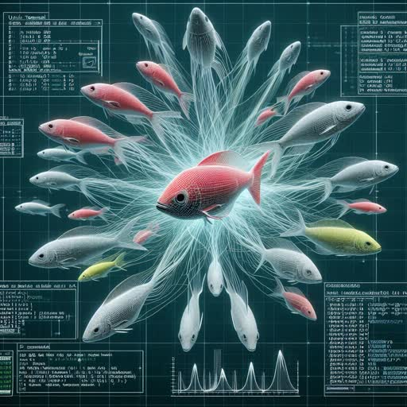

A [**resonator**](https://colab.research.google.com/github/0xmaddie/0xmaddie/blob/main/resonators.ipynb)
is like a neural net that uses racing threads and particle swarms to
approximate functions. You can train a resonator like a transformer
but it uses Python objects instead of vectors.

A **Lisp** dialect based on [John Shutt's vau calculus](https://web.cs.wpi.edu/~jshutt/kernel.html)

> Abstraction creates custom programming languages that facilitate
> programming for specific problem domains. It is traditionally
> partitioned according to a two-phase model of program evaluation,
> into syntactic abstraction enacted at translation time, and semantic
> abstraction enacted at run time. Abstractions pigeon-holed into one
> phase cannot interact freely with those in the other, since they are
> required to occur at logically distinct times.
>
> Fexprs are a Lisp device that subsumes the capabilities of syntactic
> abstraction, but is enacted at run-time, thus eliminating the phase
> barrier between abstractions.
>
> Lisps of recent decades have avoided fexprs because of semantic
> ill-behavedness that accompanied fexprs in the dynamically scoped
> Lisps of the 1960s and 70s.
>
> This dissertation contends that the severe difficulties attendant on
> fexprs in the past are not essential, and can be overcome by judicious
> coordination with other elements of language design. In particular,
> fexprs can form the basis for a simple, well-behaved Scheme-like
> language, subsuming traditional abstractions without a multiphase
> model of evaluation.

I thought this would be useful for language model agents.
