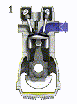

**2022-11-16** i consider foward-mode logic programming to be a type
of generative programming. final fantasy 12 gambits are a simple
example of programs like this. i think an rpg like this with language
models is a cool idea.

**2022-11-16** i'm starting to like the word
["engine"](https://en.wikipedia.org/wiki/Engine) instead of
programming language or virtual machine, due to the increased scope
languages like rust and go have taken on. there's also [compute
engine](https://en.wikipedia.org/wiki/Google_Compute_Engine) and the
[frozen transformers as universal computation
engines](https://ojs.aaai.org/index.php/AAAI/article/view/20729) paper
to motivate the use of the word "engine".

